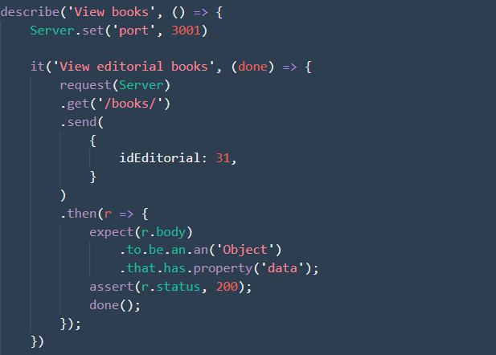
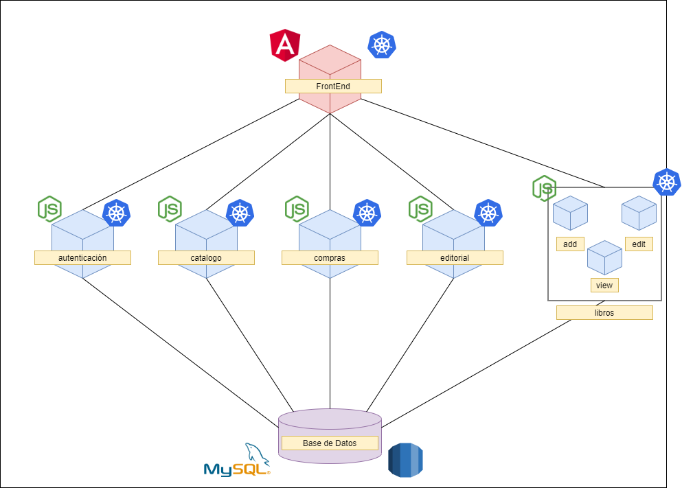

# <ins>BookSA</ins>
---
## Descripción del Proyecto

BookSA es una empresa de venta de libros guatemalteca enfocada a las ventas en linea. El sistema consiste en un ambiente donde interactuan principalmente 2 tipos de usuario, los clientes y los editoriales. Los usuarios tipo cliente solo podran adquirir libros de las distintas editoreales y los usuarios tipo editorial subir sus libros para que esten disponibles para los usuarios tipo cliente. Ademas de contar con un usuario tipo administrador que pueda autorizar el acceso de los usuarios tipo editorial que se quieran registrar.

---
### Lenguaje
El lenguaje que predomina en el desarrollo del proyecto es Javascript.

---
### Herramientas de Desarrollo Utilizadas
- <ins>NodeJS</ins>: Es un entorno en tiempo de ejecución multiplataforma, de código abierto, para la capa del servidor (pero no limitándose a ello) basado en el lenguaje de programación JavaScript, asíncrono, con E/S de datos en una arquitectura orientada a eventos y basado en el motor V8 de Google.
- <ins>Angular</ins>: Es un framework para aplicaciones web desarrollado en TypeScript, de código abierto, mantenido por Google, que se utiliza para crear y mantener aplicaciones web de una sola página. Su objetivo es aumentar las aplicaciones basadas en navegador con capacidad de Modelo Vista Controlador (MVC).

- <ins>Amazon RDS</ins>: Servicio web que facilita la configuración, el funcionamiento y el escalado de una base de datos relacional en la nube de AWS.
---
### Herramientas de Metodologia Utilizadas
- <ins>SCRUM</ins>: Marco de trabajo para desarrollo ágil de software que se ha expandido a otras industrias. Es un proceso en el que se aplican de manera regular un conjunto de buenas prácticas para trabajar colaborativamente, en equipo y obtener el mejor resultado posible de proyectos. En nuestro caso se realizaron 2-3 "daily scrums" a la semana y al final de la fase un sprint retrospective.
---
### Herramientas de Control de tiempo de Trabajo Utilizadas
- <ins>Jira</ins>: Para el tablero del unico sprint que se manejó en esta fase se utilizo Jira, el cual es una herramienta en línea para la administración de tareas de un proyecto, el seguimiento de errores e incidencias y para la gestión operativa de proyectos.
---
### Pruebas a implementar
#### Agregar Libro:
- 
- 
#### Editar Libro:
- 
- 
#### Verr Libro:
- 
- 
-   
---
## Listado de microservicios
* addbooks
* authentication 
* catalogos 
* compras 
* editbooks 
* editorial 
* frontend 
* viewbooks
* bitacora
* solicitud

Para obtener a detalle esta documentación, consultar la [colección](BackEnd/BookSA.postman_collection.json) de postman  y el [enviroment](BackEnd/BookSA%20Enviroment.postman_environment.json) 

### Arquitectura

 

#### Servicios NodePort

#### Escalamiento horizontal

 

### Diagrama ER de la base de datos
 
---
## Infraestructura como codigo
Se utiliza un Cluster de Kubernetes para levantar y administrar los servicios de forma declarativa.

Los archivos de IaC se encuentran en `kubernetes/`

Por cada microservicio se crea un **Deployment**, **Service** y un **HorizontalPodAutoscaling**

- **Deployment**: Describe una carga de trabajo. En este caso se asocia 1 Pod para cada microservicio
- **Service**: Expone el deployment anterior para que los otros puedan conectarse a él.
- **HorizontalPodAutoscaling**: Se utiliza para auto escalar los servicios en dado caso la carga de los mismos aumente. Se utiliza como métrica el uso del CPU con un porcentaje de 5%.
    * El máximo de Pods a escalar son 3 por cada servicio.
    * El mínimo es un Pod.

### Balanceador de carga

Cada servicio generado balancea automáticamente entre todos los pods como se muestra en la imagen de la sección **Servicios NodePort**

### Duplicidad de servicios

Se crean más servicios cuando el uso del CPU entre todos los Pods correspondientes supera el 5%

## ESB
Se etiquetan todas las peticiones del frontend con un campo llamado tienda, que es utilizado por el ESB para determinar a cual de los backend va redirigir la peticion.
El ESB recibe la peticion transforma la solicitud para adaptarse a los diferentes backend. Recibe la respuesta y luego tambien la tranforma de ser necesario y la envia de vuelta al origen.
 